# Hashsite

## Public-source Fractal Geocoding Library

by Matt Channon

Location still sucks.

Latitudes and longitudes are precise, but awkward for ordinary people to read, repeat, compare, shorten, and authenticate. Street addresses are familiar, but they are often vague, discontinuous, misleading, building-centric rather than door-centric, and terrible at campuses, hospitals, airports, apartment complexes, industrial sites, new construction, rural land, and anywhere the real problem is not *the parcel* but *the path from where you are to where you need to be*.

Hashsite is a public-source geocoding system designed to fix that.

It is built around a 5.1-bit alphadecimal multifractal notation that is compact, human-usable, offline-friendly, and simple enough that many of its spatial operations can be reasoned about with pencil and paper.

A short Hashsite can identify an area. A longer one can identify a doorway. Add vertical information and it can identify the correct floor. Add a **hashpath** and it can describe not just a point, but the actual sequence of arrival decisions that gets a person, package, or ambulance to the right place.

**Start here:**

- [Licensing overview](licensing.md)
- [Buy the Hashsite Developer Welcome Kit](/buy/)
- [Full commercial licensing terms](COMMERCIAL-LICENSE.md)
- [Welcome Kit terms](WELCOME-KIT.md)

---

## Why Hashsite exists

The biggest failure of existing location systems is not that they cannot describe a point.

It is that real-world arrival often is **not a point problem**.

It is a **path problem**.

Consider:

- a gated apartment complex with several similar mid-rise buildings and poor signage
- a hospital that has expanded three times and now has six viable entrances, two parking structures, and one useless street address
- an airport with multiple pickup levels and duplicate door numbers
- a loading dock or service entrance that is nowhere near the building’s official address
- a tow truck, courier, friend, or paramedic trying to find the *actual* access point at night, in weather, under stress

Traditional street addresses solve this badly. Pure coordinate systems solve only the final point. What3Words and similar systems often solve only a *single lookup target*, and do not naturally express proximity, stepwise movement, or how to get from the curb to the correct door.

Hashsite is designed to solve the whole arrival problem.

---

## What Hashsite is for

Hashsite is intended for:

- meet here
- put the package here
- park here
- use this gate
- enter here
- go up this staircase
- go to this floor
- deliver to this door
- start here, then follow this route

The ideal output is not “close enough.”

The ideal output is “nobody calls back to say they can’t find it.”

---

## License

Hashsite is **public-source**, not OSI open source.

Hashsite is free for **Free-Tier Users** under the [Hashsite Public License v2.0](LICENSE).

A paid commercial license is required for:

- governments
- militaries
- intelligence agencies
- law-enforcement agencies
- public-sector bodies
- contractors acting on their behalf
- large commercial enterprises

A low-friction **Developer Welcome Kit** is available for users in those paid buckets who need a quick, lawful on-ramp:

- **$999**
- **3-year term**
- **up to 5 named developers**
- **one legal entity**
- **one product, service, or internal program**
- **limited production use**

See:

- [licensing.md](licensing.md)
- [LICENSE](LICENSE)
- [NOTICE](NOTICE)
- [COMMERCIAL-LICENSE.md](COMMERCIAL-LICENSE.md)
- [WELCOME-KIT.md](WELCOME-KIT.md)
- [Buy the Hashsite Developer Welcome Kit](/buy/)

Licensing contact: **licensing@hashsite.org**

---

## The basic idea

Hashsite starts from a simple 6x6 grid using capital letters and digits.

Fill in the numbers and letters:

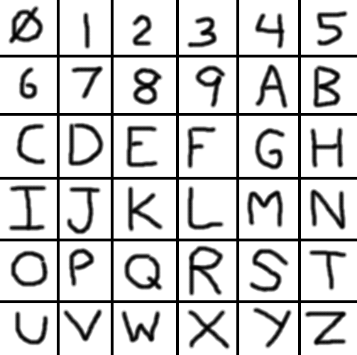

That is most of the system.

Every Hashsite location may be written with a leading `#` and trailing `^`. These are optional, but helpful for recognition in plain text.

The point is not novelty for novelty’s sake. The point is to create a location language that is:

- compact
- scalable in precision
- spatially logical
- human-usable
- offline-friendly
- extensible beyond a flat point on a map

---

## Why this is better than “just use lat/lon”

Latitude and longitude are important and are not going away. They remain the machine room underneath modern GPS.

But for ordinary human communication they have several obvious drawbacks:

- they are verbose
- they use a centuries-old notation convention that is not intuitive for most people
- they rely on punctuation and directional conventions that are easy to garble
- they are not naturally social
- they are poor at progressive shortening
- they do not themselves express an arrival workflow
- most people cannot compare two lat/lon strings by eye in a useful everyday way

Hashsite is designed to be easier to shorten, easier to relay, easier to compare, and easier to use as a social or logistical placestamp.

---

## Why this is better than “just use a street address”

Street addresses are often adequate when:

- there is one obvious entrance
- the building has sane numbering
- the map data is up to date
- there are no gates, barriers, pickup decks, service entrances, parking constraints, or internal routing issues

That is not the world we actually live in.

A building address is often not a usable delivery point, a usable pickup point, a usable patient entrance, a usable ambulance entrance, or a usable parking location.

Hashsite is not trying to replace every ordinary address in the world.

It is trying to solve the cases where the ordinary address is not enough.

---

## Hashpath: the real point

A **single point** is often inadequate for real navigation.

A delivery driver does not just need “the property.”  
They need:

1. where to turn in
2. which gate or driveway to use
3. where to stop or park
4. which entrance matters
5. whether stairs, elevator, loading bay, or lobby is relevant
6. the final handoff point

That is the main pain point in modern wayfinding.

Hashsite addresses this with **hashpath**.

### What is a hashpath?

A hashpath is a compact route description built from:

- one or more hashsites
- optional local diffs between them
- optional vertical markers
- optional semantic labels in software or UI

A hashpath turns “go to this point” into “follow this arrival sequence.”

### Why hashpath matters

A static point works well for:

- a picnic table
- a trailhead
- a rural gate
- a broken-down car on a highway shoulder

A static point works badly for:

- apartment complexes
- campuses
- hospitals
- airports
- hotels
- event venues
- warehouses
- multi-entrance office buildings
- pickup and dropoff choreography

Hashpath is the missing layer between raw coordinates and actual arrival.

### Example: apartment complex

Instead of only this:

`#9E3ZDC4AX^`

you send a hashpath conceptually equivalent to:

- enter complex here
- park here
- use this staircase
- go to this landing
- final door here, 8m above street level

The final door is still a point.

But the success of the trip depends on the path.

### Example: hospital

A hospital visit usually has at least four distinct relevant places:

- correct parking structure
- correct exterior entrance
- correct desk or elevator bank
- correct clinic door

A street address gives you none of that.  
A point gives you only one of those.  
A hashpath can give you all of them.

### Example: airport pickup

“Door 08” is useless if there are two Door 08s on different levels.

A hashpath can specify:

- arrivals level curb
- lane or side
- exact standing point
- fallback pickup point if traffic control moves you

### Example: delivery

For delivery platforms, the last 30 meters are where the waste happens.

The address got the driver to the parcel.  
The app got the driver to the curb.  
The customer still gets the text:

> “I’m here.”

Hashpath is meant to eliminate that text.

---

## Precision and shortening

Hashsite is designed so that shorter codes describe larger areas and longer codes describe more precise ones.

If one character is good enough, use one character.  
If you need the correct doorway or handoff point, use more.

A properly designed location system should not force unnecessary length when the use case is broad, or unnecessary vagueness when the use case is precise.

Any two-character Hashsite, regardless of where it is on Earth, should be approximately 600x600 km, with each additional character reducing the area by another stage of subdivision. Eight characters describe approximately 13x13 m, and nine describe about a 2 meter square.

This means the same notation can be used for:

- regions
- neighborhoods
- buildings
- entrances
- rooms
- doors
- curbside handoff points

---

## Human logic matters

A major complaint about many alternative addressing systems is that nearby places do not look nearby, and changing one element can teleport you across the globe.

Hashsite is designed around spatial logic rather than obfuscation.

It aims to preserve useful human intuitions such as:

- shorter vs longer means broader vs more precise
- nearby movement should be describable in a structured way
- relative movement should not require a proprietary server
- the notation should still mean something without a network round trip

That matters for:

- trust
- memorability
- debugging
- dispatch
- map reading
- fallback operation
- emergencies

---

## Pencil-and-paper friendliness

Hashsite is designed so that many directional adjustments can be reasoned about directly.

That does not mean every user will do map math by hand.

It means the system is built on a logic transparent enough that they **could**.

That is a real advantage.

A location system should not become useless the moment a company server disappears, a lookup API is rate-limited, or a user loses connectivity.

---

## Spheroid optimization

Consider the Mercator projection, including the parts Mercator left off:

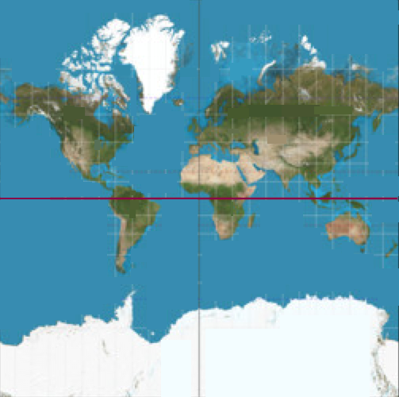

Let’s begin by applying our 6x6 grid to it:

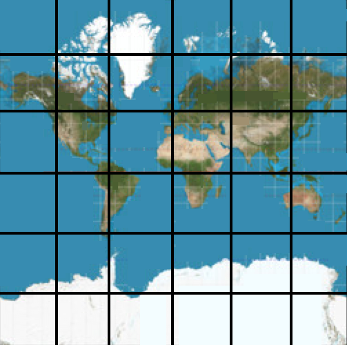

This works, but it overrepresents the poles and underrepresents the equator. By adjusting the subdivision, we can make each first-level area equal in size:

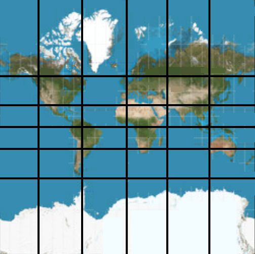

The latitude lines are at `0°`, `19.47°`, and `41.81°`, splitting the Earth into six equally sized slices.

Now no matter the first character, we are talking about the same amount of area.

Take `#B^`:

Split it into a 6x6 grid:

For tropical and mid-latitudes, these are not very square, so we instead use a 9x4 grid:

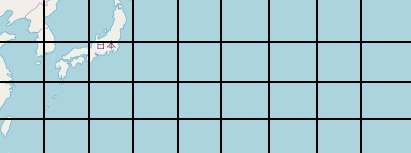

Accordingly with `#BA^`:

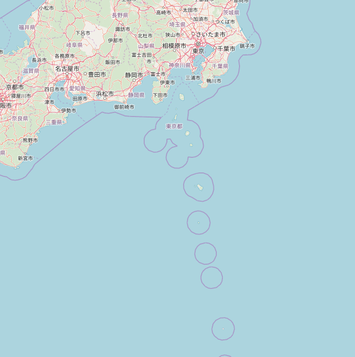

From the third digit onward, we return to the 6x6 grid:

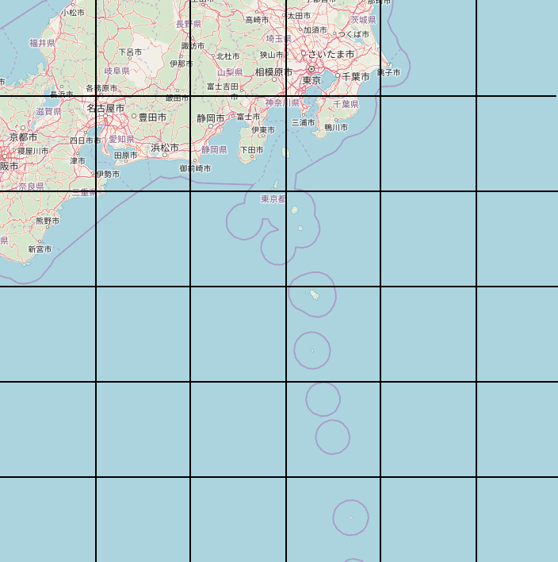

And `#BA3^`:

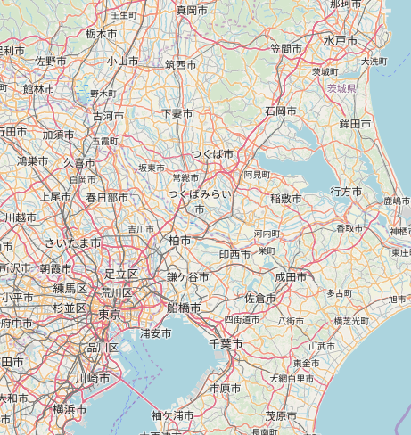

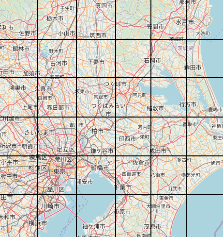

And `#BA3U^`:

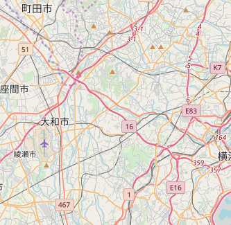

The goal is not just elegance. The goal is fairer area representation, shorter useful codes, and more human-coherent subdivision.

---

## Polar regions

The poles require different handling.

If you took a polar region such as `#1^`:

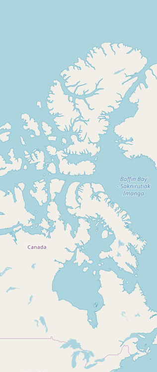

and split it into a normal 9x4 or 6x6 grid, you would get absurdly precise longitudes and absurdly imprecise latitudes:

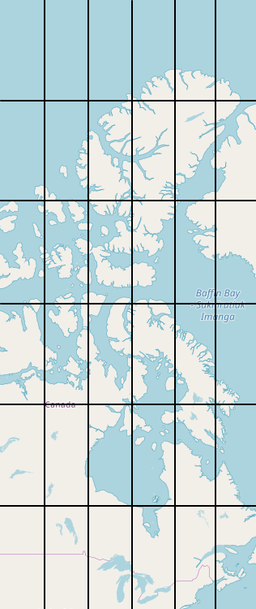

So polar regions are split differently. Instead of `9/9/9/9`, Hashsite uses:

`1/1/2/3/3/4/5/5/6/6`

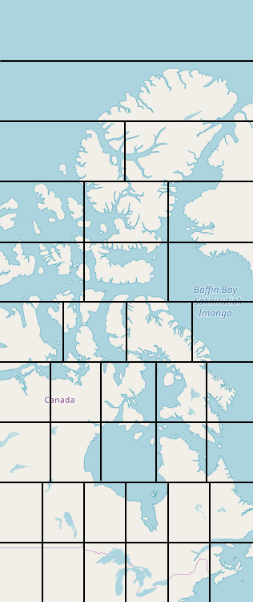

These do not look square in the projection, but they are much closer in actual represented area.

From there, the system again returns to the ordinary 6x6 grid.

---

## Decimals and visual ambiguity

It is well known that `O` and `0` can be confused, and that `I`, `l`, and `1` can be confused.

Most systems solve this by throwing away characters.

Hashsite keeps the full 36-value set because the density gain matters.

To reduce ambiguity:

- letters are always CAPITAL
- optional dots may be placed before digits
- dots are advisory for readability, not semantic

For example:

`#L.1L.0OI^`

and

`#ILLO.0.1^`

remain distinguishable in ordinary use.

That matters when the system is being relayed in text messages, notes, signs, screenshots, tweets, and speech.

---

## Vertical space

A real location system should not pretend the world is flat.

The difference between the first floor and the fiftieth floor is not trivia. In an emergency, a delivery, or a meetup, it can be the difference between success and failure.

Hashsite includes a vertical component after the carat.

For example:

`#F.6NZ^J` means 1 meter below street level  
`#F.6NZ^1` means 1 meter above street level  
`#F.6NZ^0` handles the 0m case

This covers most everyday building-navigation situations.

If a second post-carat character is added, it acts like a higher-order digit, multiplying by 18.

Examples:

`#F.6NZ^.1.1` = 19 meters above street level  
`#F.6NZ^.1.0` = exactly 18 meters above street level  
`#F.6NZ^.1I` = exactly 18 meters below street level

A second trailing carat switches the frame to sea level rather than street level.

Examples:

`#F.6NZ^^` = sea level  
`#F.6NZ^1^` = 1 meter above sea level  
`#F.6NZ^2^J` = 2 meters above a street level that is itself 1 meter below sea level

The system can also extend below 1-meter resolution and above kilometer-scale elevation ranges using additional post-carat characters.

In short: Hashsite is designed to describe the actual place, not a flattened cartoon of it.

---

## Error correction

Human-entered location strings should have optional error checking.

Hashsite uses the Luhn Algorithm as the basis for a checksum approach.

The checksum is optional, short, and intended to catch common entry mistakes without bloating the code unnecessarily.

For example:

`#2A0E78^`

could be checksummed as:

`#2A0E78j^`

The goal is not perfection. The goal is reducing avoidable human error in ordinary relay.

---

## Examples of real-world use

### Friend’s apartment

A friend in a badly marked complex sends you:

- the preferred gate
- the correct parking spot
- the applicable staircase
- the correct floor
- the actual door

You arrive once, not twice.

### Doctor’s office or hospital

Your appointment message includes:

- parking
- the correct entrance
- the correct clinic node
- the final room or desk

No “which building is this?” call.

### Delivery

A customer provides:

- curbside anchor
- service gate
- loading point or lobby
- final handoff

No “I’m here” deadlock.

### Towing or emergency response

A stranded driver sends one precise placestamp from the shoulder of a highway, or a broader one if that is all they have time to verify.

An ambulance is sent to the actual scene, not the nearest misleading address.

---

## Why public-source matters

Location is basic infrastructure.

A good placestamp system should not depend on a single company deciding who may resolve it, who may implement it, which languages matter, what the lookup terms are, or whether users are allowed to build on top of it.

Hashsite is intended to be public enough to spread, clear enough to implement, and extensible enough that new apps, platforms, maps, logistics products, and accessibility tools can adopt it without begging for permission first.

The long-term goal is not to create a novelty code.

It is to create a durable public location layer.

---

## What a full Hashsite ecosystem looks like

Hashsite is not just a notation. It needs tooling.

The full ecosystem should include:

- reference codecs
- multiple language implementations
- map integrations
- iOS and Android apps
- browser tools
- route builders
- hashpath authoring tools
- delivery and pickup UX
- hospital, campus, airport, and venue templates
- API access where useful
- offline-first client-side logic wherever possible

The ideal user base is not “mapping enthusiasts.”

It is everybody.

---

## Frequently Asked Questions

### Do we really need another one of these?

Yes, because the problem is still not solved.

Street addresses solve one part of the problem.  
Coordinates solve another.  
A practical human placestamp system should solve more of it at once.

### Can’t existing systems already do this?

Some of the pieces exist elsewhere.

But the combination usually does not:

- compact code
- progressive precision
- logical local movement
- offline friendliness
- vertical support
- route-or-path support
- human legibility
- public implementability

Hashsite is an attempt to put those in one system.

### Can’t you make the codes smaller?

Only up to a point.

You can always trade completeness or clarity for a shorter token, but that often means giving up oceans, poles, altitude, hand calculation, or human consistency.

Hashsite tries to be short without becoming magical nonsense.

### Isn’t the real problem just bad signage?

Sometimes, yes.

But bad signage is everywhere, and software should help people survive the world as it is, not the world as a facilities manager imagines it to be.

### Why not just send a pin?

Pins work until they don’t.

Pins are brittle in screenshots, speech, paper relay, and repeated reuse. They do not themselves express scale, verticality, or arrival sequence.

Hashsite is meant to be a portable placestamp, not merely a UI gesture inside one app.

---

## Roadmap

1. Finalize the core specification
2. Finalize hashpath notation and delta conventions
3. Publish reference codecs
4. Ship examples in multiple languages
5. Build browser tools
6. Build iOS and Android apps
7. Build delivery, hospital, and campus demos
8. Publish robust documentation and FAQs
9. Evangelize adoption
10. Make arrival less stupid

---

To hear a bunch of HN readers opine on this without seeing it, visit [https://news.ycombinator.com/item?id=19511917](https://news.ycombinator.com/item?id=19511917), do a find for `mchannon`.
