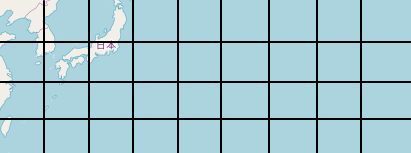

Open-source Geocoding Library

by Matt Channon

Paradigm/How-to

Geocoding is all about representing a fixed point in space in as short and reproducible a way as possible. If it can be done simply, so much the better.

Hashsite’s primary philosophy is 5.1-bit alphadecimal encoding. It sounds complicated but it’s actually quite simple.

Start with a 6x6 grid:

Fill in the numbers and letters (capital letters only):

And this is mostly it.

Every hashsite location has a prefix of “#”, and ends with "^".  The "#" and "^" are optional, but lend themselves well toward identifying what is intended.

Consider the Mercator projection (including the parts Mercator left off):

Let’s start with applying our 6x6 grid to our old friend the Mercator projection:

This works, but it overrepresents the area at the poles and underrepresents the area at the equator.  By using the 6x6 grid, we can tweak this a bit to make each area equal:

The latitude lines are at 0°, 19.47°, and 41.81°, splitting the Earth into six equally-sized slices.
Now no matter the first character, we’re talking about the same amount of area.

So let’s take #B^:

And split it into a 6x6 grid:

These aren’t very square, so for tropical and mid latitudes, we use a 9x4 grid, 9/9/9/9:

accordingly with #BA^:

For the third digit on, we go back to the 6x6 grid:

And #BA3^:

And #BA3U^:

There. Compare #BA3U^ with these other encoding systems:

GeoHash: xn73 (twice as wide, and not square)

Plus.Codes: 8Q7XCJ00+ (or CJFF+XX Yokohama)

W3W: galaxies.gift.issue

There’s one more thing to remember with Hashsite: the polar regions.

If you took a polar region (say, #1^):

and split it into a 9x4 or even a 6x6 grid, we’d find ourselves with ridiculously precise longitudes and ridiculously imprecise latitudes:

So for polar regions only, we split it differently; instead of 9/9/9/9, we use 1/1/2/3/3/4/5/5/6/6:

These don't look square because of the projection, but they're all very similar in size. From here, we also go back to the 6x6 grid:

Any two-character hashsite, regardless of where it is on Earth, should be approx. 600x600 km, with each additional character taking off a power of 6x6, so 100x100km, ~16x16km, and so on. Eight characters will describe approx. 13x13m, and nine will describe a 2 meter square.

There’s nothing wrong with shortening your hashsite code, as each hashsite is presumed to be the center of the grid square. If one character is good enough to represent your site, you can use one character.

That’s all you need to know about Hashsite, but here are some more features:

*Decimals

It’s well-known that o and 0 look a lot alike, and I, l, and 1 look a lot alike.  Most geocoding systems take steps to avoid this problem.  But in order for Hashsite to have 36 values, we have to use every letter and number.  

All Hashsite letters are CAPITAL. It’s not yelling, it’s practical.

This means no problems with lowercase L: getting a 1 and a capital L confused is not likely. Getting a capital O and a numeric 0 with a slash should be also unlikely. Nonetheless, we can add dots into a hashsite to help avoid the difference. Dots can and should go before any number (0 and 1 in particular) but never before any letter. They are not required, but they help people understand the difference between:

#L.1L.0OI^ (20 miles NE of Moscow):

and #ILLO.0.1^ (30 miles NW of Abu Dhabi):

So if you’re going to tweet where the party at the old quarry is going to be, you can leave the dots in there and ignore them when punching them into your Hashsite-enabled map app.

*Vertical space

To add a message regarding vertical space, we add after the carat to the end:

#F.6NZ^

Then we use the same 6x6 grid in the following manner:

So #F.6NZ^I would mean 1 meter below street level, and #F.6NZ^H would mean 1 meter above street level. This covers -18m to 18m inclusively (#F.6NZ^, the carat followed by no character, handles the 0m case). This covers most everyday wayfinding situations involving up to 6-story buildings.

As soon as you precede the initial post-carat character with a second character, it acts as a sort of conventional “tens digit”, multiplying each value by 18:

#F.6NZ^.1H would thus be 19 (1 x 18 + 1) meters above street level.  How would we do 18 meters above street level? #F.6NZ^00, the first zero being a special case indicating we’re at exactly 18. #F.6NZ^0Z would equal exactly 18 meters beneath street level.

Finally, trailing the entire hashsite with a second carat means that the vertical number is relative to sea level, not street level. #F.6NZ^^ means we’re at sea level, #F.6NZ^H^ means 1 meter above sea level. #F.6NZ^H^G means 2 meters above a street level that is itself 1 meter above sea level.

Do we decide to go big or go small? Someone might want finer than 1m precision in terms of the height or depth of a location, and they may also want to describe the altitude of a geosynchronous satellite tens of thousands of km above a given point. Or scarily enough, both. In the event we're dealing with >1km of distance from street level and/or <1m of precision, we use the two carats differently:

As soon as we have three characters after a carat, the first "street level" becomes fractional meters, and the second "sea level" becomes decimal meters, stored much as conventional numbers are stored, except with base-36 numbers.

So to represent 1 cm below street level at #F.6NZ^, we reserve the highest bit for signing and use the rest of the first character to indicate the number of 18ths of a meter we mean.  Since 1/100th is less than a single 1/18th, the rest is zero, but the signing bit makes this "I".

The second character is in terms of 1/18/36, or 648ths of a meter. For 1/100, this means we're at 6/648ths and change, or "6".

The third character has to account for the remaining .48/648ths in the next unit, 18x36x36 = 23328ths of a meter, or 17, a.k.a. "H".

The fourth character has to account for the remaining .28/23328ths in the next unit, 18x36x36x36 = 839808ths of a meter, or 10, a.k.a. "A".

We could go on for a while, but suffice it to say, we're really close to 1 cm after four characters:

#F.6NZ^I6HA

Similar math ensues for after the second carat, except we start with the smallest numbers first (including the signing bit) and work our way rightward until the last character represents the most significant bits. 

*Error correction

None of the existing approaches actually employs an error correction system like a checksum. While obfuscating systems like What3Words can reduce potential errors, they can also introduce them, since precaution.green.raincoat is very easy to confuse with precautions.green.raincoat.

Hashsite uses a tried-and-true approach: the Luhn Algorithm. While you may not have heard of the Luhn, your credit card has. We take every character, doubling every other one, and add them together, multiply by X (X = 9 for credit cards, X = 25 for our purposes), and take the last result digit. This is referred to as a "checksum". It ensures that even hand-entered credit cards are very unlikely to be run through the system if not keyed in properly.

Adding one more character on the end sounds great, but we like our codes short, and our error corrections optional. If we're going to make the error correction optional, and don't want to add a symbol, how can we tell our error correction code isn't part of our hashsite code?

Lowercase. Hashsites don't contain lowercase letters, so a lowercase checksum makes it clear what that character is doing. One other thing: turning an alphadecimal checksum into lowercase works great for letters, but for numbers? There's no lowercase number 7. We adjust for this by making the checksum strictly alphabetical instead of alphadecimal (26-value instead of 36-value).

#2A0E78^ would thus be checksummed as #2A0E78j^.

#2AEB71^ might be a bit of a problem, as that would be #2AEB71l^, which someone might confuse with #2AEB711^ if they handwrote it or made a poor choice of font. Nevertheless, a checksum misinterpreted is a minor risk.

*Word mode

Unlike What3Words’ patented scheme for deriving three disjointed words from a location, the hashsite approach isn’t to take spatial coordinates and squish them into a huge single integer number which we bust apart again. We simply take the 2-character alphadecimal “bytes” (1332 unique values, 1296 for each possible pair and another 36 for single characters) and run them through an open-source alphabetic dictionary, in alphabetical order, to construct a sentence.

It's much easier to remember "John's green raincoat is dirty" than "precautions.green.raincoat", but it's also much easier to come up with it.

Word mode uses separate dictionaries for different parts of speech.

1: Nouns

2: Adjectives

3: Possessives

4: Verbs

5: Predicate Objects or Predicate Adjectives (Nouns or Adjectives)

So a detailed hashsite like #M2DE3200ZZ^ would follow the dictionary as #1122334455, but the sentence would follow:

33 22 11 44 55

1. Noun M2: Raincoat
1. Adjective DE: Green
1. Possessive 32: John's
1. Verb 00: is (predicate adjective form)
1. Predicate Adjective ZZ: dirty

Vertical components following the carat symbol (^) take the form of a proper name at the end of the sentence.  So if #M2DE3200ZZ^ is "John's green raincoat is dirty", #M2DE3200ZZ^2I would be "John's green raincoat is dirty, Michelle."  

While mnemonics are handy, they don't do all that well for error consistency. Say the postal service in a country adopts this system and the carrier has trouble reading the handwriting, interpreting the above as "John's green raincoat is dry". This could correspond to a few houses down from the intended recipient, and is a bad outcome.

So "obfuscated mode" is also supported, where if it's not exact, it's quite clear it's wrong. The postal carrier will type the phrase into his computer and come up with the middle of the South Atlantic ocean instead of the wrong house on the right street.

We achieve obfuscated mode by changing the order around to a question. Something like "Is John's green raincoat dirty?", only we need to reorder the input string.

So keeping #M2DE3200ZZ^, for this mode only, we would first reorder it to put the odd characters first followed by the evens: MD30Z2E20Z, reverse it, Z02E2Z03DM, then run it through our sentence generator function:

Paula's Angry Yak Will Cost Irving.  In the form of a question: #Will Paula's Angry Yak Cost Irving?^

Not the easiest mnemonic to remember, but a heckuva lot better than #M2DE3200ZZ^.

All the words are 4-7 letters long, common, without spaces or punctuation, alphabetically sequenced, and we're careful not to use plurals where they might confuse people.  

To Do:

1. Finalize All Conditions
1. Upload Open Source Dictionaries
1. Upload Codecs
1. ???
1. Profit (from MIT-licensed open source)

To hear a bunch of HN readers opine on this without seeing it, visit [https://news.ycombinator.com/item?id=19511917](https://news.ycombinator.com/item?id=19511917), do a find for "mchannon".
